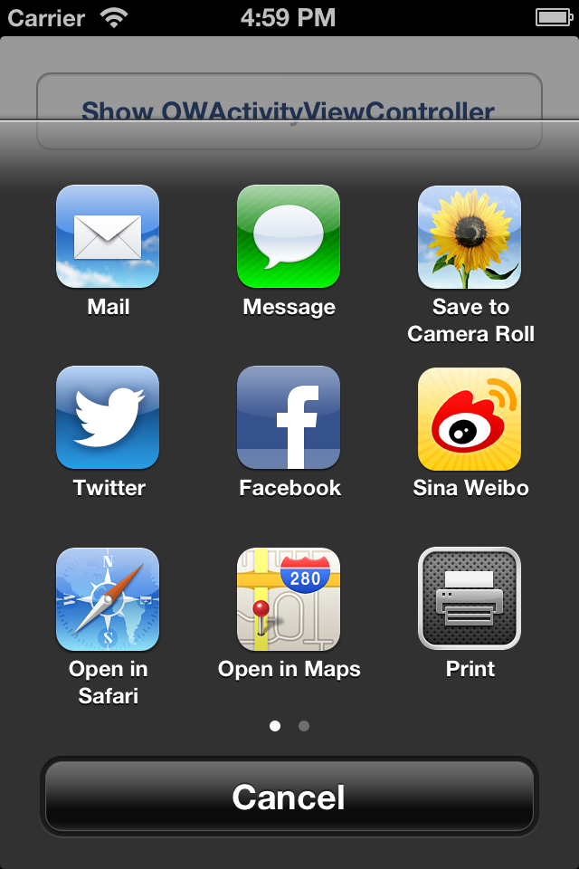
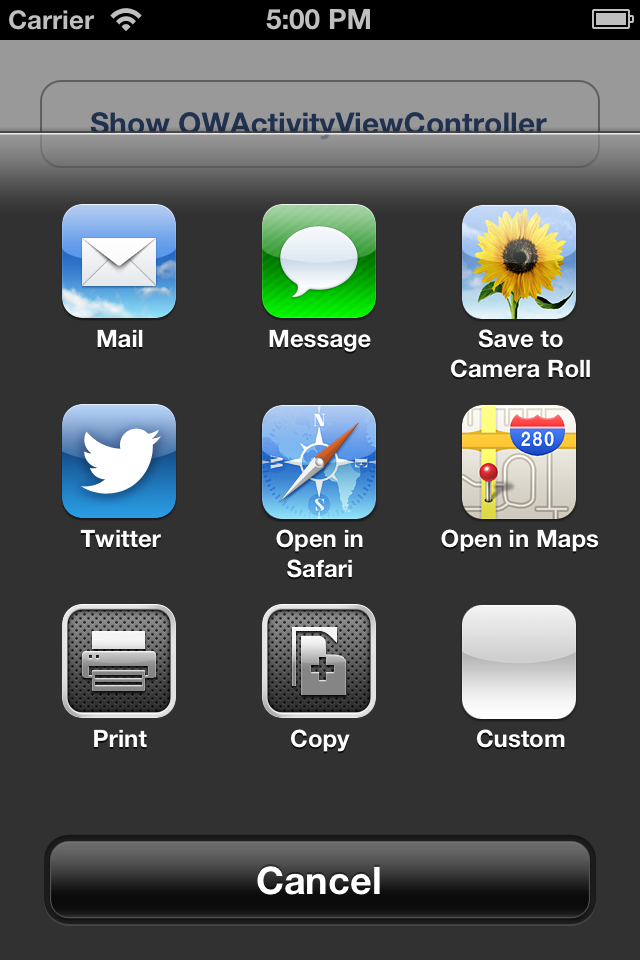

# OWActivityViewController

<table>
                                                         <tr>
		<th>iOS 6.x</th>
		<th>iOS 5.x</th>
	</tr>
	<tr>
		<td></td>
		<td></td>
	</tr>
</table>

> [OWActivityViewController](https://github.com/brantyoung/OWActivityViewController) is a slim fork of [REActivityViewController](https://github.com/romaonthego/REActivityViewController), with no external dependence, only support iOS integrated Social Network (for iOS 6: Twitter/Facebook/SinaWeibo, for iOS 5: Twitter).

iOS 6 includes deep Twitter, Facebook and SinaWeibo integration in Social.framework. But `UIActivityViewController` won't show Twitter/Facebook/SinaWeibo as share options, if corresponding account is not set up in iOS Settings.

On the apple pre installed apps (ie. Photos app), both Twitter Facebook and SinaWeibo should always appear, tapping them without an account set up in settings prompts you to do so.

The purpose of `OWActivityViewController` is provide an alternative to UIActivityViewController, which:

1. Make third party apps the same behavior as pre installed apps (such as Photos app) under iOS 6
1. Compatible with iOS 5.0 (lacks Facebook and SinaWeibo support)

It allows to create custom activites with ease, you control their apperance and behavior and no longer restricted to single-color icons as with the default `UIActivity`.

> Out of the box activities include:

> * Twitter
* Facebook (only supported in iOS 6)
* Sina Weibo (only supported in iOS 6)
* Message
* Mail
* Open in Safari
* Save to Album
* Open in Maps
* Print
* Copy

> All activites are compatible with iOS 5.0.

## Requirements
* Xcode 4.5 or higher
* Apple LLVM compiler
* iOS 5.0 or higher
* ARC

## Demo

After that, build and run the `OWActivityViewControllerExample` project in Xcode to see `OWActivityViewController` in action.

## Installation

`OWActivityViewController` needs to be linked with the following frameworks:

* AssetsLibrary
* MessageUI

The following framework must be added as optional (weak reference):

* Social
* Twitter

## Example Usage

### Configuring & presenting OWActivityViewController

Presenting `OWActivityViewController` is easy as 1-2-3. First, prepare activities that you're going to use.
You can create custom activities right here in your code, no need to wrap your head around subclassing or providers as with `UIActivityViewController`.
Once your activities are ready, prepare data source (userInfo) and present the view controller.

``` objective-c
// Prepare activities
//
OWFacebookActivity *facebookActivity = [[OWFacebookActivity alloc] init];
OWTwitterActivity *twitterActivity = [[OWTwitterActivity alloc] init];
OWSinaWeiboActivity *sinaWeiboActivity = [[OWSinaWeiboActivity alloc] init];
OWMessageActivity *messageActivity = [[OWMessageActivity alloc] init];
OWMailActivity *mailActivity = [[OWMailActivity alloc] init];
OWSafariActivity *safariActivity = [[OWSafariActivity alloc] init];
OWSaveToCameraRollActivity *saveToCameraRollActivity = [[OWSaveToCameraRollActivity alloc] init];
OWMapsActivity *mapsActivity = [[OWMapsActivity alloc] init];
OWPrintActivity *printActivity = [[OWPrintActivity alloc] init];
OWCopyActivity *copyActivity = [[OWCopyActivity alloc] init];

// Create some custom activity
//
OWActivity *customActivity = [[OWActivity alloc] initWithTitle:@"Custom"
                                                         image:[UIImage imageNamed:@"OWActivityViewController.bundle/Icon_Custom"]
                                                   actionBlock:^(OWActivity *activity, OWActivityViewController *activityViewController) {
                                                       [activityViewController dismissViewControllerAnimated:YES completion:^{
                                                           NSLog(@"Info: %@", activityViewController.userInfo);
                                                       }];
                                                   }];

// Compile activities into an array, we will pass that array to
// OWActivityViewController on the next step
//
NSArray *activities = @[facebookActivity, twitterActivity, sinaWeiboActivity,
messageActivity, mailActivity, safariActivity, saveToCameraRollActivity, mapsActivity,
printActivity, copyActivity, customActivity];

// Create OWActivityViewController controller and assign data source
//
OWActivityViewController *activityViewController = [[OWActivityViewController alloc] initWithViewController:self activities:activities];
activityViewController.userInfo = @{
    @"image": [UIImage imageNamed:@"Flower.jpg"],
    @"text": @"Hello world!",
    @"url": [NSURL URLWithString:@"https://github.com/brantyoung/OWActivityViewController"],
    @"coordinate": @{@"latitude": @(37.751586275), @"longitude": @(-122.447721511)}
};

[activityViewController presentFromRootViewController];
```

You can also define per-activity userInfo dictionaries, for instance:

``` objective-c
twitterActivity.userInfo = @{@"image": [UIImage imageNamed:@"Flower.jpg"],
                             @"text": @"Hello world! via @myapp"};
```

### iPad specific

On iPad, you should use `UIPopoverController` to present `OWActivityViewController`.
`_popoverController` property of `UIViewController` is still a private API (sigh), so we'll need to pass it manually:
`activityViewController.presentingPopoverController = _activityPopoverController;`

``` objective-c
// Create OWActivityViewController controller and assign data source
//
OWActivityViewController *activityViewController = [[OWActivityViewController alloc] initWithViewController:self.navigationController activities:activities];
    @"image": [UIImage imageNamed:@"Flower.jpg"],
    @"text": @"Hello world!",
    @"url": [NSURL URLWithString:@"https://github.com/romaonthego/OWActivityViewController"],
    @"coordinate": @{@"latitude": @(37.751586275), @"longitude": @(-122.447721511)}
};

_activityPopoverController = [[UIPopoverController alloc] initWithContentViewController:activityViewController];
activityViewController.presentingPopoverController = _activityPopoverController;
[_activityPopoverController presentPopoverFromBarButtonItem:self.navigationItem.rightBarButtonItem
                                   permittedArrowDirections:UIPopoverArrowDirectionAny animated:YES];
```

Please note that our presenting view controller is the navigation controller, so we pass it in `initWithViewController`.

### Creating custom activities

Creating custom activitis is super easy:

``` objective-c
OWActivity *customActivity = [[OWActivity alloc] initWithTitle:@"Custom"
                                                         image:[UIImage imageNamed:@"OWActivityViewController.bundle/Icon_Custom"]
                                                   actionBlock:^(OWActivity *activity, OWActivityViewController *activityViewController) {
                                                       [activityViewController dismissViewControllerAnimated:YES completion:^{
                                                           NSLog(@"Hey, there!");
                                                       }];
                                                   }];
```

If you want to subclass an activity, add this code into your `init` function, for example:

``` objective-c
#import "MyCustomActivity.h"
#import "OWActivityViewController.h"

@implementation MyCustomActivity

- (id)init
{
    return [super initWithTitle:@"My Activity"
                          image:[UIImage imageNamed:@"My_Icon"]
                    actionBlock:^(OWActivity *activity, OWActivityViewController *activityViewController) {
                        // Your code goes here
                    }];
}

@end

```

## Customization

All views are exposed for your customization. Say, you want to change controller background and customize cancel button, here is how you would do it:

``` objective-c
OWActivityViewController *activityViewController = [[OWActivityViewController alloc] initWithViewController:self activities:activities];

activityViewController.activityView.backgroundImageView.image = [UIImage imageNamed:@"My_Cool_Background"];
[activityViewController.activityView.cancelButton setBackgroundImage:[UIImage imageNamed:@"My_Cool_Button"] forState:UIControlStateNormal];
```

Your custom activity icons must be 118x118 pixels and should include gloss, rounded corners and shadows. Easy way to make them:

1. Open your 114x114 icon with rounded corners in Photoshop (you can convert your square icon using template from http://appicontemplate.com).
2. Adjust canvas size to be 118x118, so the top part of the icon touches top part of the canvas.
3. Add drop shadow to the icon layer: angle 90, opacity 40%, distance 2px, size 2px.

## Contact

Brant Young

- https://github.com/brantyoung

## Acknowledgement

Roman Efimov

- https://github.com/romaonthego
- https://twitter.com/romaonthego
- romefimov@gmail.com

## License

OWActivityViewController is available under the MIT license.

Copyright © 2013 Brant Young.
Copyright © 2013 Roman Efimov.

Permission is hereby granted, free of charge, to any person obtaining a copy of this software and associated documentation files (the "Software"), to deal in the Software without restriction, including without limitation the rights to use, copy, modify, merge, publish, distribute, sublicense, and/or sell copies of the Software, and to permit persons to whom the Software is furnished to do so, subject to the following conditions:

The above copyright notice and this permission notice shall be included in all copies or substantial portions of the Software.

THE SOFTWARE IS PROVIDED "AS IS", WITHOUT WARRANTY OF ANY KIND, EXPRESS OR IMPLIED, INCLUDING BUT NOT LIMITED TO THE WARRANTIES OF MERCHANTABILITY, FITNESS FOR A PARTICULAR PURPOSE AND NONINFRINGEMENT. IN NO EVENT SHALL THE AUTHORS OR COPYRIGHT HOLDERS BE LIABLE FOR ANY CLAIM, DAMAGES OR OTHER LIABILITY, WHETHER IN AN ACTION OF CONTRACT, TORT OR OTHERWISE, ARISING FROM, OUT OF OR IN CONNECTION WITH THE SOFTWARE OR THE USE OR OTHER DEALINGS IN THE SOFTWARE.

## Used in App

* Oneword ArtBible
  <a href="https://itunes.apple.com/app/yi-ju-hua-sheng-jing/id643595493?mt=8&uo=4" target="itunes_store"></a>
